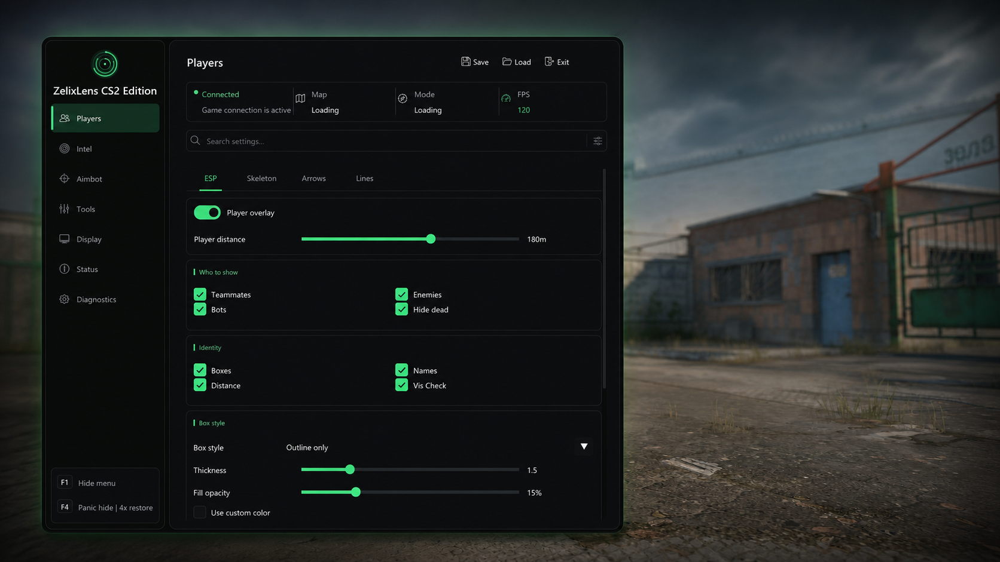

# ZelixLens CS2 Edition

**External, read-only Counter-Strike 2 overlay for Windows 10/11 x64.**

ZelixLens is a proprietary, binary-distributed **CS2 cheat and external overlay** for Counter-Strike 2. It provides player ESP, radar and world information, configurable aim/aimbot settings, presets, and display controls while remaining external to the game process.

> [!IMPORTANT]
> ZelixLens is unofficial third-party software and is not affiliated with or endorsed by Valve. Use of third-party gameplay software may violate game or platform rules and can result in account restrictions. You are responsible for understanding the rules that apply to your account.

## Preview

ZelixLens CS2 Edition player-overlay settings and control panel.

## Features

- Player ESP with boxes, skeletons, health, armor, weapons, distance, tracers, and visibility filters
- Radar, directional indicators, world markers, bomb information, spectator list, proximity alerts, and flash warnings
- Configurable aim and aimbot settings including FOV, smoothing, target bone, target priority, sticky targeting, and activation keys
- Custom crosshairs, colors, visual profiles, display options, and saveable presets
- F1 menu toggle, F4 panic hide, and adjustable overlay frame rate
- Secure launcher with encrypted local key storage and authenticated automatic updates

## External and read-only

ZelixLens runs separately from CS2. Its game-data transport is read-only: it does not inject code into CS2 and does not write to CS2 process memory. The current customer release uses a kernel-backed read transport.

External and read-only describes the software architecture. It is **not** a guarantee against detection, account action, software incompatibility, or future game updates.

## Download

Download only the complete package from this repository:

1. Open the [latest official release](../../releases/latest).
2. Download `ZelixLens-CS2-Edition.zip` from **Assets**.
3. Compare the package hash with `SHA256SUMS.txt` by following [VERIFY.md](VERIFY.md).
4. Extract the complete ZIP and run `ZelixLens.Launcher.exe`.
5. Enter your access key and select **Verify & Launch**.

Do not download executables sent through direct messages or unofficial mirrors.

## Verify before running

Every official release includes:

- `SHA256SUMS.txt` for asset-integrity checks
- `update-manifest.txt` and `update-manifest.sig` for authenticated updater metadata
- `ZelixLens-CS2-Edition.provenance.json` for release provenance
- `ZelixLens-CS2-Edition-NOTICES.txt` for software and third-party license notices

See [VERIFY.md](VERIFY.md) for PowerShell verification steps. A checksum confirms that a file matches the published release; it does not independently prove that software is safe or suitable for your system.

## System requirements

- Windows 10 or Windows 11, x64
- Counter-Strike 2
- An active ZelixLens access key
- Network access for license verification and authenticated updates

CS2 changes frequently. Review the publication date and compatibility notes on the [latest release](../../releases/latest) before installing.

## Security and troubleshooting

If security software reports or quarantines a file, stop and verify that it came from the official release and matches the published SHA-256 value. Do not disable operating-system security controls solely to force an unverified binary to run.

Report suspected tampering or a security vulnerability privately by following [SECURITY.md](SECURITY.md). For installation and account help, use [SUPPORT.md](SUPPORT.md).

## Access and official channels

Daily, weekly, monthly, and lifetime access options are handled through the [official ZelixLens Discord](https://discord.gg/KaA3YBZ43D). Never post license keys, passwords, recovery codes, or personal information in a public GitHub or Discord message.

## Documentation

- [Release history](CHANGELOG.md)
- [Verify a download](VERIFY.md)
- [Privacy notice](PRIVACY.md)
- [Support](SUPPORT.md)
- [Security policy](SECURITY.md)
- [Software license](LICENSE.md)
- [Documentation contributions](CONTRIBUTING.md)

## License

ZelixLens is proprietary software. An access license grants a limited right to run the official binary while the access period is active; it does not transfer ownership or grant source-code rights. See [LICENSE.md](LICENSE.md) and the complete notices included with every release.

Counter-Strike, Counter-Strike 2, CS2, Steam, and Valve are trademarks or registered trademarks of Valve Corporation. Their use here is descriptive only.

**[Download latest](../../releases/latest)** · **[Verify](VERIFY.md)** · **[Support](https://discord.gg/KaA3YBZ43D)**

ZelixLens CS2 Edition · Official releases by Zaroomx

